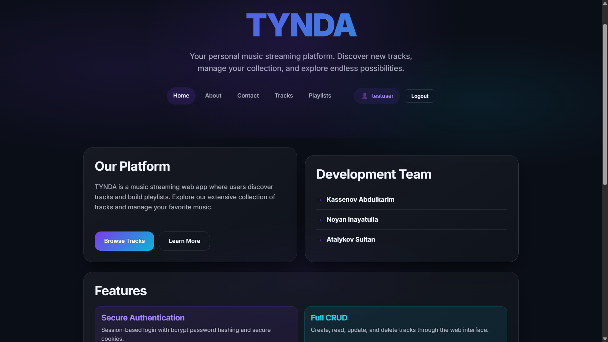
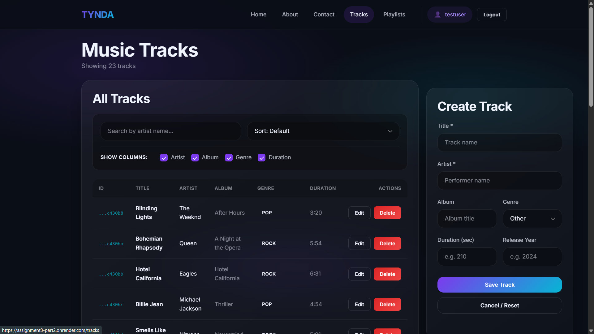
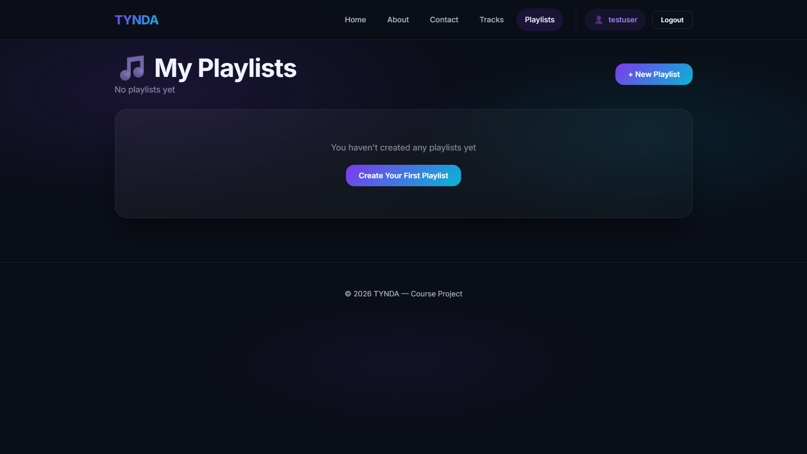

# TYNDA Music Streaming Platform

A web application for music track management with secure session-based authentication, role-based access control, and personal playlists.

🌐 **Live Demo:** [https://assignment3-part2.onrender.com](https://assignment3-part2.onrender.com)

**Course:** Web Technologies (Backend)  
**Assignment:** Final Project - Production Web Application (Week 10)  
**Team:** Kassenov Abdulkarim, Noyan Inayatulla, Atalykov Sultan

---

## Features

### Authentication & Security
- Session-based authentication with express-session
- Password hashing using bcrypt (10 salt rounds)
- HttpOnly cookies for XSS protection
- Secure session storage in MongoDB

### Role-Based Access Control
- **Two roles**: `user` and `admin`
- Users can only modify their own tracks
- Admins have full access to all resources
- Admin panel for user management

### Core Functionality
- Full CRUD operations for tracks with **pagination**
- Personal playlists for each user
- Search, filter, and sort functionality
- Ownership indicators in UI (★ for your tracks)
- Responsive modern UI with glassmorphism design

---

## Tech Stack

| Layer | Technology |
|-------|------------|
| Backend | Node.js, Express.js |
| Database | MongoDB Atlas |
| Sessions | express-session, connect-mongo |
| Security | bcryptjs |
| Frontend | HTML5, CSS3, JavaScript |
| Hosting | Render |

---

## Project Structure

```
assignment3_part2/
├── server.js              # Main server file
├── package.json           # Dependencies
├── .env                   # Environment variables (not in repo)
├── database/
│   └── db-mongodb.js      # MongoDB connection
├── middleware/
│   └── auth.js            # Auth & role middleware
├── routes/
│   ├── auth.js            # Auth routes (login, register, logout)
│   ├── tracks.js          # Tracks CRUD with pagination
│   ├── playlists.js       # Playlists CRUD routes
│   └── admin.js           # Admin-only routes
├── scripts/
│   └── seed.js            # Database seeding script
└── public/
    ├── index.html         # Home page
    ├── tracks.html        # Tracks management with pagination
    ├── playlists.html     # Playlists management
    ├── admin.html         # Admin panel (admin only)
    ├── login.html         # Login page
    ├── register.html      # Registration page
    ├── about.html         # About page
    ├── contact.html       # Contact page
    ├── 404.html           # Error page
    └── style.css          # Styles
```

---

## Quick Start

### 1. Install Dependencies

```bash
npm install
```

### 2. Configure Environment

Create `.env` file:

```env
PORT=3009
MONGO_URI=your_mongodb_connection_string
SESSION_SECRET=your_secret_key
NODE_ENV=development
```

### 3. Seed Database

```bash
npm run seed
```

This creates 25 sample tracks and 2 test users:
- `admin@tynda.kz` / `admin123` (ADMIN)
- `test@tynda.kz` / `test123` (USER)

### 4. Run Server

```bash
# Development (with auto-restart)
npm run dev

# Production
npm start
```

### 5. Open Browser

Navigate to `http://localhost:3009`

---

## API Endpoints

### Authentication

| Method | Endpoint | Description | Auth |
|--------|----------|-------------|------|
| POST | `/api/auth/register` | Create new account | No |
| POST | `/api/auth/login` | Login to account | No |
| POST | `/api/auth/logout` | Logout current user | Yes |
| GET | `/api/auth/me` | Get current user info + role | No |

### Tracks

| Method | Endpoint | Description | Auth | Owner/Admin |
|--------|----------|-------------|------|-------------|
| GET | `/api/tracks` | Get paginated tracks | No | - |
| GET | `/api/tracks/:id` | Get single track | No | - |
| POST | `/api/tracks` | Create new track | Yes | - |
| PUT | `/api/tracks/:id` | Update track | Yes | ✓ |
| DELETE | `/api/tracks/:id` | Delete track | Yes | ✓ |

### Playlists

| Method | Endpoint | Description | Auth |
|--------|----------|-------------|------|
| GET | `/api/playlists` | Get user's playlists | Yes |
| GET | `/api/playlists/:id` | Get playlist with tracks | Yes |
| POST | `/api/playlists` | Create new playlist | Yes |
| PUT | `/api/playlists/:id` | Update playlist | Yes |
| DELETE | `/api/playlists/:id` | Delete playlist | Yes |
| POST | `/api/playlists/:id/tracks` | Add track to playlist | Yes |
| DELETE | `/api/playlists/:id/tracks/:trackId` | Remove track | Yes |

### Admin (Admin only)

| Method | Endpoint | Description | Auth |
|--------|----------|-------------|------|
| GET | `/api/admin/stats` | Get platform statistics | Admin |
| GET | `/api/admin/users` | Get all users | Admin |
| PATCH | `/api/admin/users/:id/role` | Update user role | Admin |
| DELETE | `/api/admin/users/:id` | Delete user | Admin |

### Query Parameters (GET /api/tracks)

| Parameter | Description | Example |
|-----------|-------------|---------|
| `page` | Page number (default: 1) | `?page=2` |
| `limit` | Items per page (default: 10, max: 50) | `?limit=20` |
| `artist` | Filter by artist name | `?artist=Queen` |
| `title` | Filter by title | `?title=Bohemian` |
| `genre` | Filter by genre | `?genre=Rock` |
| `sortBy` | Sort results | `?sortBy=title` |
| `fields` | Select fields | `?fields=title,artist` |

---

## Security Implementation

### Password Hashing

```javascript
const hashedPassword = await bcrypt.hash(password, 10);
```

### Session Configuration

```javascript
app.set('trust proxy', 1); // Required for Render/Heroku

app.use(session({
    secret: process.env.SESSION_SECRET,
    resave: false,
    saveUninitialized: false,
    store: MongoStore.create({ mongoUrl: process.env.MONGO_URI }),
    cookie: {
        httpOnly: true,         // Prevents JS access (XSS protection)
        secure: true,           // HTTPS only in production
        sameSite: 'lax',        // CSRF protection
        maxAge: 86400000        // 1 day
    }
}));
```

### Protected Route Middleware

```javascript
function isAuthenticated(req, res, next) {
    if (req.session && req.session.userId) {
        return next();
    }
    return res.status(401).json({ error: 'Unauthorized' });
}
```

---

## Database Collections

### Users
```javascript
{
  _id: ObjectId,
  username: String,
  email: String,
  password: String,      // bcrypt hashed
  createdAt: Date
}
```

### Tracks
```javascript
{
  _id: ObjectId,
  title: String,
  artist: String,
  album: String,
  genre: String,
  durationSeconds: Number,
  releaseYear: Number,
  createdAt: Date,
  createdBy: ObjectId    // User reference
}
```

### Playlists
```javascript
{
  _id: ObjectId,
  name: String,
  description: String,
  userId: ObjectId,      // Owner
  tracks: [ObjectId],    // Track references
  createdAt: Date,
  updatedAt: Date
}
```

---

## Scripts

| Command | Description |
|---------|-------------|
| `npm start` | Start server |
| `npm run dev` | Start with nodemon |
| `npm run seed` | Seed database |

---

## Screenshots

### Home Page
- Modern glassmorphism design
- Feature overview
- API documentation


### Tracks Management
- View all tracks with filtering
- Create, edit, delete tracks
- Column projection


### Playlists
- Personal playlists for each user
- Add/remove tracks
- Create, edit, delete playlists
---

## License

This project was created for educational purposes as part of the Web Technologies course at Astana IT University.